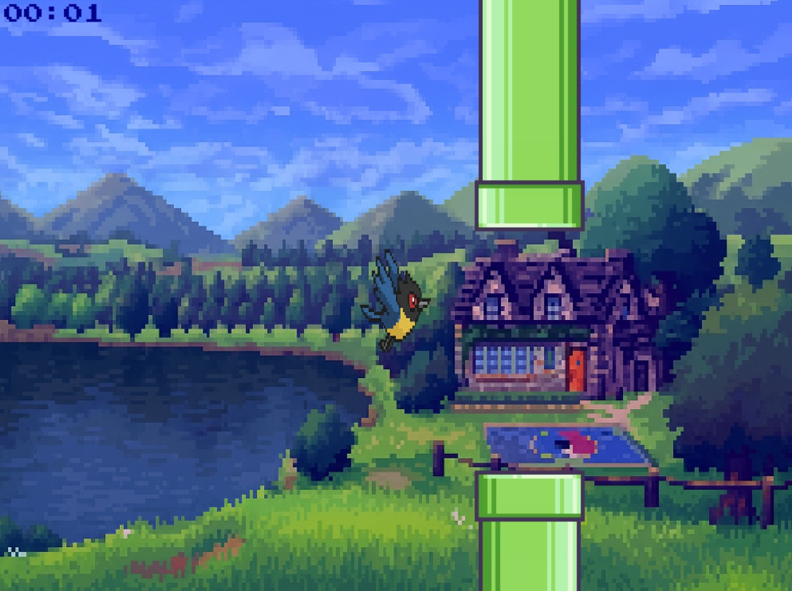

# Projeto Final | 2025.1


# Tappy Wings


## Autores

- [@mearramos](https://www.github.com/mearramos): Maria Ramos 
- [@xXFelipeBrownieXx](https://github.com/xXFelipeBrownieXx): Felipe 


## Como rodar o código?
1. Instale o Python, se ainda não estiver no sistema. Acesse [python.org](https://www.python.org/downloads/) para baixar.
2. Instale a biblioteca **Pygame** executando:
   ```bash
   pip install pygame
3. Na pasta do projeto, execute o arquivo principal:
   ```bash
   python roda_jogo.py
3. Siga as instruções fornecidas nas telas para jogar.

## Demonstração + link



## Referência

 - [Tutorial | Pygame](https://insper.github.io/DesignDeSoftware/pygame/handout/)
 - [StackOverFlow](https://stackoverflow.com/questions)
 - [Documentação Pygame](https://www.pygame.org/docs/ref/image.html)
 - [Ameaça Interestelar | Jogo Espacial](https://github.com/MicaeleGomes/Ameaca-Interestelar-Jogo-Espacial)


## FAQ

#### Como funciona?
O jogador deve passar pelas três fases no jogo, estas que tem a dificuldade aumentada através da velocidade dos canos. Cada fase tem duração de 45 segundos, com mudança de cenário e design dos obstáculos. 


